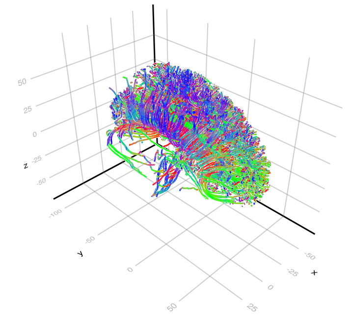

# tractography

<!-- optional text here -->

--- 

`tractography`, abbreviated `tg`, is a Python package that implements different tractography algorithms.

The software provides the ``tractography`` Python module, which includes **functions and tools to produce streamlines from diffusion MRI**.

<h2 class="display-4 text-center">Features</h2>

  

    

      

        <h3 class="card-title">Feature 1</h3>
        

            Lorem ipsum dolor sit amet, consectetur adipiscing elit. Aliquam scelerisque ultrices molestie. Proin sit amet vehicula nibh. Lorem ipsum dolor sit amet, consectetur adipiscing elit. 
        

      

    

  

  

    

      

        <h3 class="card-title">Feature 2</h3>
        

            Lorem ipsum dolor sit amet, consectetur adipiscing elit. Aliquam scelerisque ultrices molestie. Proin sit amet vehicula nibh. Lorem ipsum dolor sit amet, consectetur adipiscing elit. 
        

      

    

  

  

    

      

        <h3 class="card-title">Feature 3</h3>
        

            Lorem ipsum dolor sit amet, consectetur adipiscing elit. Aliquam scelerisque ultrices molestie. Proin sit amet vehicula nibh. Lorem ipsum dolor sit amet, consectetur adipiscing elit. 
        

      

    

  

  

    

      

        <h3 class="card-title">Feature 4</h3>
        

            Lorem ipsum dolor sit amet, consectetur adipiscing elit. Aliquam scelerisque ultrices molestie. Proin sit amet vehicula nibh. Lorem ipsum dolor sit amet, consectetur adipiscing elit. 
        

      

    

  

